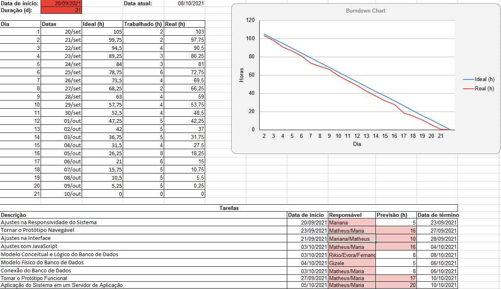
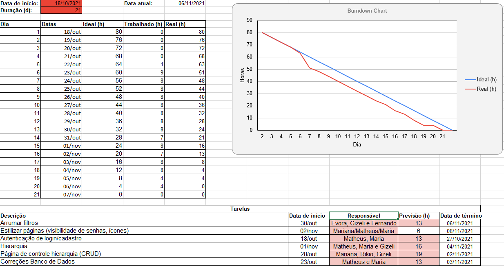
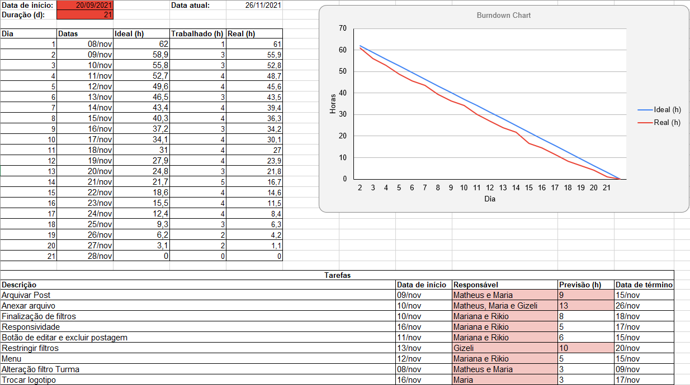

<br id="inicio">

<h1 align="center">A.P.I - The Achievers</h1>
 <p align="center">
     <a href="#equipe">Equipe</a> • 
     <a href="#sobre">Sobre</a> • 
     <a href="#status">Status</a> • 
     <a href="#tecnologias">Tecnologias</a> • 
     <a href="#execucao">Execução</a> • 
     <a href="#organizacao">Organização</a> • 
     <a href="#user-stories">User Stories</a> • 
     <a href="#prototipo">Protótipo</a>  • 
     <a href="#requisitos">Requisitos</a> • 
     <a href="#backlog-produto">Backlog do Produto</a> • 
     <a href="#backlog-sprints">Backlog das Sprints</a> • 
     <a href="#burndown">Burndown</a> • 
     <a href="#entregas">Entregas</a>
</p>

<span id="equipe">

### :busts_in_silhouette: Equipe:
Função | Nome | GitHub & LinkedIn
-------|------|------------------
Scrum Master | Evora de Castro | [](https://github.com/MinEvora) [](https://www.linkedin.com/in/evora-castro-704911133/)
Product Owner | Fernando Satoru Eto | [](https://github.com/fernandoeto)
Dev Team | Gizeli Martins Fonseca | [](https://github.com/gizelifonseca)
Dev Team | Maria Clara Alves de Faria | [](https://github.com/mclaralvs) [](https://www.linkedin.com/in/mclaralvs/)
Dev Team | Mariana Ayumi Tamay | [](https://github.com/Mariayumi) [](https://www.linkedin.com/in/mariana-ayumi-159582222/)
Dev Team | Matheus Henrique Lemes Sakuragui | [](https://github.com/MatheusSakuragui) [](https://www.linkedin.com/in/matheus-henrique-lemes-sakuragui/)
Dev Team | Rikio Anzai | [](https://github.com/rikioanzai) [](https://www.linkedin.com/in/rikio-anzai-053ba921b/)

> Instituição: Fatec São José dos Campos - Prof. Jessen Vidal
> 
> Curso: Desenvolvimento de Software Multiplataforma/1º Semestre

<span id="sobre">

### :mag_right: Sobre o projeto:
<p>Esse projeto está sendo desenvolvido de acordo com os requisitos acordados com o cliente, o qual pediu um portal de informações, tanto para docentes, quanto para discentes, a fim de exibir avisos que seguem um determinado filtro. Os comunicados são visualizados de maneira hierárquica e, devido ao recurso de filtro, a busca por esses será mais sucinta, resolvendo o problema raíz: o grande volume de mensagens recebidas e, consequentemente, perdidas devido à grande procura durante a pandemia do novo Covid-19.</p>
 
 <span id="status">

 ### :bookmark_tabs: Status do projeto: concluído :heavy_check_mark:
  
 <span id="tecnologias">

### :computer: Tecnologias utilizadas até o momento:
<p align="center">
    </img>
    </img>
    
    
    </img>
    
    
    
    
    
    
    
</p>
  
↑ [Voltar ao início](#inicio) 
  
<span id="execucao">

### :hammer: Executando a aplicação:

#### Você pode acessar por esse link: <a href="https://api-theachievers-2021.herokuapp.com/">aqui!</a>
 
#### Ou então,
 
#### Primeiramente, certifique-se se tem o Python, caso não tenha, acesse <a href="https://www.python.org/downloads/">aqui</a> 
```python 
 # Clone este repositório;
 
 # Redirecione-se à pasta referente ao repositório clonado;
 
 # Abra o prompt de comando e confirme se este está com o endereço da pasta correto;
   
 cd API-2021-2
 
 # Instale os requisitos para rodar a aplicação;
   
 pip install -r requirements.txt
 
 # Você terá que alterar as informações do Banco de Dados MySQL;
 
 ## Caso não possua o MySQL clique nesse link! https://dev.mysql.com/downloads/windows/installer/8.0.html%22%3E
 
 # Abra o app.py, insira essas informações e substitua com as suas credenciais:
 
 app.config['MYSQL_HOST'] = 'localhost'
 app.config['MYSQL_USER'] = 'root'
 app.config['MYSQL_PASSWORD'] = '*sua senha*'
 app.config['MYSQL_DB'] = 'fatec_api'

 # E insira as suas credenciais.

 # Abra o MySQL Workbench e se conecte com seu BD;
 
 # Após isso abra o script localizado em  "src/static/db" e o execute os seguintes arquivos:
 
 ## Primeiramente, o 'fatec_api.sql'
 
 ## Após isso, execute o 'script_api.sql'
 
 # Execute a aplicação;
   
 app.py
 
 # Acesse o link no qual a aplicação está hospedada;
   
 http://127.0.0.1:5000/
 
# Para acessar como administrador use:
 
> E-mail: adm@fatec.sp.gov.br
> Senha: fatec
 
# RM para funcionários:

 > Diretor: 11111
 > Coordenador: 22222
 > Secretaria: 33333
 > Professor: 44444
```
 
<span id="organizacao">

### :clipboard: Organização do repositório:
<p> :file_folder: <strong>doc</strong> - pasta que contém o wireframe, tanto para desktop, quanto para mobile;</p> 
<p> | - :open_file_folder: <strong>prototipo</strong> - pasta que contém demonstração do protótipo em arquivos .gif;</p>
<p> | - :open_file_folder: <strong>burndown</strong> - pasta que contém arquivos de demonstração do esforço distribuído pela equipe.</p>
<p> :file_folder: <strong>scr</strong> - pasta que contém duas outras, <em>templates</em> e <em>static</em>;</p>
<p> | - :open_file_folder: <strong>templates</strong> - pasta que contém os códigos de estruturação (.html);</p>
<p> | - :open_file_folder: <strong>static</strong> - pasta que contém outras duas, <em>css</em> e <em>img</em>;</p>
<p> | - - :open_file_folder: <strong>js</strong> - pasta que contém os códigos referentes à javascript (.js);</p>
<p> | - - :open_file_folder: <strong>db</strong> - pasta que contém tudo referente à parte de banco de dados;</p>
<p> | - - :open_file_folder: <strong>css</strong> - pasta que contém os códigos de estilização (.css);</p>
<p> | - - :open_file_folder: <strong>img</strong> - pasta que contém a logo da FATEC e o favicon, além de outra pasta, <em>footer</em>;</p>
<p> | - - - :open_file_folder: <strong>footer</strong> - pasta que contém todas as imagens utilizadas no rodapé das páginas.</p>
 
↑ [Voltar ao início](#inicio) 
 
<span id="user-stories">

### :pushpin: User Stories:
Quem | Quer | A fim de
-----|------|---------|
Cliente | Priorizar a divulgação de informações da FATEC-SJC | Não ocorrer a perda de informações importantes
Administrador | Privilégios de acesso | Administrar e controlar as permissões de acesso de todos os usuários do sistema
Diretor | Reunir informações por evento | Repassá-las a todos os servidores da unidade
Secretário administrativo | Selecionar informações por curso | Publicar o edital interno das disciplinas do respectivo curso
Secretário acadêmico | Classificar as informações por assunto | Enviá-las para professores e alunos
Coordenador | Organizar as informações por disciplinas | Divulgá-las aos respectivos professores
Professor | Notificar os alunos sobre datas importantes | Informar sobre entregas de atividades e realização de exames
Aluno | Receber informações sobre estágios e palestras | Participar dos processos seletivos e eventos
 
↑ [Voltar ao início](#inicio) 
 
<span id="prototipo">
 
### :memo: Protótipo:
 
#### Página de login;

 
#### Página de cadastro;

 
#### Página de feed para usuários sem privilégios;

 
#### Página de feed para administrador;

 
#### Página para envio de informações.

 
↑ [Voltar ao início](#inicio) 
 
<span id="requisitos">
 
### :page_with_curl: Requisitos:
Código | Requisitos funcionais 
-------|----------------------
RF. #1 | Envio de informações para divulgação via sistema (Administrador)
RF. #2 | Possibilidade de anexar documentos (e.g.: PDFs, Docs etc.)
RF. #3 | Visualização de informações de divulgação via sistema de modo seletivo (filtro por data, interessados, curso etc.)
RF. #4 | Acesso às informações do sistema através de perfis de usuário/papéis (adm, usuário comum, coordenador de curso etc.)
 
Código | Requisitos Não-Funcionais
-------|---------------------------
RNF. #1 | Desenvolver o back-end com a linguagem Python 3+ e o microframework Flask
RNF. #2 | Utilizar o sistema gerenciador de banco de dados MariaDB/MySQL/PostGresSQL
RNF. #3 | Utilizar HTML-5 para arquitetura da informação da aplicação
RNF. #4 | Utilizar CSS-3 para especificação do layout e demais características de renderização da interface com o usuário
RNF. #5 | Utilizar o GitHub para controle de versão dos artefatos de projeto
RNF. #6 | Interface com navegação intuitiva (e.g.: acesso à informação com poucos "cliques")
RNF. #7 | Sistema responsivo
RNF. #8 | Utilizar JavaScript no front-end (obs: pode fazer uso de framework)
 
↑ [Voltar ao início](#inicio) 
 
<span id="backlog-produto">

### :bar_chart: Backlog do Produto:
Nome da tarefa | Prioridade | Status
---------------|------------|--------
Wireframe da interface de login do status | Alta | Completa
Wireframe da interface de cadastro de usuário | Alta | Completa
Wireframe da interface de divulgação de informações prioritárias | Alta | Completa
Repositório do projeto | Alta | Completa
Documentação do sistema | Alta | Completa
Interface de login do sistema | Alta | Completa
Interface de cadastro de usuário | Alta | Completa
Interface de divulgação de informações prioritárias | Alta | Completa
Outras interfaces conforme solicitação do cliente | Alta | Completa
Ajustes na responsividade do sistema | Alta | Completa
Tornar o protótipo navegável | Alta | Completa
Ajustes na interface | Alta | Completa
Ajustes com JavaScript | Média | Completa
Modelos conceitual e lógico do banco de dados | Alta | Completa
Modelo físico do banco de dados | Alta | Completa
Conexão do banco de dados | Alta | Completa
Tornar o protótipo funcional | Alta | Completa
Aplicação do sistema em um servidor de aplicação | Alta | Completa
Introdução das hierarquias | Alta | Completa
Introdução da autenticação do usuário | Alta | Completa
Ajustes dos filtros | Alta | Completa
Controle de hierarquia (CRUD) | Alta | Completa
Estilizar páginas | Média | Completa
Ajustes no banco de dados | Alta | Completa
Introdução da funcionalidade total dos filtros | Alta | Completa
Introdução da função "arquivar" | Média | Completa
Introdução da função "anexar" | Alta | Completa
Testes unitários do sistema | Alta | Completa
Testes de integração | Alta | Completa
Testes de aceitação | Alta | Completa
Melhorias contínuas | Alta | Completa
 
↑ [Voltar ao início](#inicio) 

<span id="backlog-sprints"> 
 
### :chart_with_upwards_trend: Backlog das sprints:

Sprint | Nome da tarefa | Prioridade | Status
-------|----------------|------------|-------
#1 | Wireframe da interface de login do status | Alta | Completa
#1 | Wireframe da interface de cadastro de usuário | Alta | Completa
#1 | Wireframe da interface de divulgação de informações prioritárias | Alta | Completa
#1 | Repositório do projeto | Alta | Completa
#1 | Documentação do sistema | Alta | Completa
#1 | Interface de login do sistema | Alta | Completa
#1 | Interface de cadastro de usuário | Alta | Completa
#1 | Interface de divulgação de informações prioritárias | Alta | Completa
 
Sprint | Nome da tarefa | Prioridade | Status
-------|----------------|------------|-------
#2 | Ajustes na responsividade do sistema | Alta | Completa
#2 | Tornar o protótipo navegável | Alta | Completa
#2 | Ajustes na interface | Alta | Completa
#2 | Ajustes com JavaScript | Média | Completa
#2 | Modelo conceitual e lógico do banco de dados | Alta | Completa
#2 | Modelo físico do banco de dados | Alta | Completa
#2 | Conexão do banco de dados | Alta | Completa
#2 | Tornar o protótipo funcional | Alta | Completa
#2 | Aplicação do sistema em um servidor de aplicação | Alta | Completa
 
Sprint | Nome da tarefa | Prioridade | Status
-------|----------------|------------|-------
#3 | Introdução das hierarquias | Alta | Completa
#3 | Introdução da autenticação do usuário | Alta | Completa
#3 | Ajustes dos filtros | Alta | Completa
#3 | Controle de hierarquia (CRUD) | Alta | Completa
#3 | Estilizar páginas | Médio | Completa
#3 | Ajustes no banco de dados | Alta | Completa
 
Sprint | Nome da tarefa | Prioridade | Status
-------|----------------|------------|-------
#4 | Introdução da funcionalidade total dos filtros | Alta | Completa
#4 | Introdução da função "arquivar" | Média | Completa
#4 | Introdução da função "anexar" | Alta | Completa
#4 | Testes unitários do sistema | Alta | Completa
#4 | Testes de integração | Alta | Completa
#4 | Testes de aceitação | Alta | Completa
#4 | Melhorias contínuas | Alta | Completa
 
↑ [Voltar ao início](#inicio) 
 
<span id="burndown">
 
### :chart_with_downwards_trend:	Burndown:

#### Sprint #1;
 
<p></img></p>
 
#### Sprint #2;
<p></img></p>
 
#### Sprint #3;
<p></img></p>
 
#### Sprint #4;
<p></img></p>

 
↑ [Voltar ao início](#inicio) 
 
<span id="entregas">
 
### :triangular_flag_on_post: Entregas
 
Sprint | Data Início | Data Entrega | Links |
-------|-------------|--------------|-------|
#1 | 30.08.2021  |  19.09.2021  | [:checkered_flag:](https://github.com/TheAchieversDSM/A.P.I-2021-2/releases/tag/v1.0) |
#2 | 20.09.2021  |  10.10.2021  | [:checkered_flag:](https://github.com/TheAchieversDSM/A.P.I-2021-2/releases/tag/v2.0) |
#3 | 18.10.2021  |  07.11.2021  | [:checkered_flag:](https://github.com/TheAchieversDSM/A.P.I-2021-2/releases/tag/v3.0) |
#4 | 08.11.2021  |  28.11.2021  | [:checkered_flag:](https://github.com/TheAchieversDSM/A.P.I-2021-2/releases/tag/v4.0) |
 
↑ [Voltar ao início](#inicio) 
